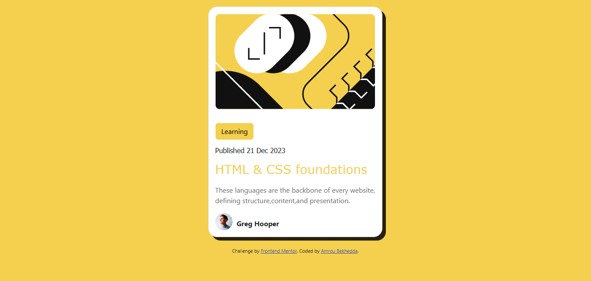

# Frontend Mentor - Blog preview card solution

This is a solution to the [Blog preview card challenge on Frontend Mentor](https://www.frontendmentor.io/challenges/blog-preview-card-ckPaj01IcS).


## Table of contents

- [Overview](#overview)
  - [The challenge](#the-challenge)
  - [Screenshot](#screenshot)
  - [Links](#links)
- [My process](#my-process)
  - [Built with](#built-with)
  - [What I learned](#what-i-learned)
  - [Useful resources](#useful-resources)
- [Author](#author)
- [Acknowledgments](#acknowledgments)

**Note: Delete this note and update the table of contents based on what sections you keep.**

## Overview

### The challenge

Users should be able to:

- See hover and focus states for all interactive elements on the page

### Screenshot



### Links

- Solution URL: [solution URL](https://github.com/Amoru-Bek/blog-preview-card)
- Live Site URL: [live site URL](https://amoru-bek.github.io/blog-preview-card/)

## My process

### Built with

- Semantic HTML5 markup
- CSS custom properties
- Flexbox
- CSS Grid
- [Bootstrap](https://getbootstrap.com/) - For styles

### What I learned

Building dynamic  web pages that can fit all devices and Deeping my understanding of Css  

Code snippets :

```html
<div>
  
  <b style="margin-left: 5px;">Greg Hooper</b>
</div>
```
```css
.card{
  display: flex;
  flex-direction: column;
  background-color: white;
  box-shadow: 8px 8px 0 rgba(0, 0, 0, 0.84);
  transition: 0.3s;
  width: auto;
  border-radius: 1.28rem;
  margin: 1rem 1rem 1.5rem 1rem;
  height: auto;
  border: 1px solid #ddd;
  overflow: hidden;
  max-width: 400px;
}
.card:hover{
  box-shadow: 0 8px 16px 0 rgba(0, 0, 0, 0.2);
  transform: translateY(-5px);
}
}
```

### Useful resources

- [Free CSS tutorials whit W3schools](https://www.w3schools.com/Css/default.asp) - Which helped me creating the card.
- [Bootstrap Framework](https://getbootstrap.com/) - An amazing Css Framework.

## Author

- Linkedin - [Amrou Bekhedda](https://www.linkedin.com/in/amrou-bekhedda-99b314341/)
- Frontend Mentor - [@Amrou Bekhedda](https://www.frontendmentor.io/profile/Amoru-Bek)
- Github - [@Amoru-Bek](https://github.com/Amoru-Bek)

## Acknowledgments

Thanks [Frontend Mentor](https://www.frontendmentor.io/)
